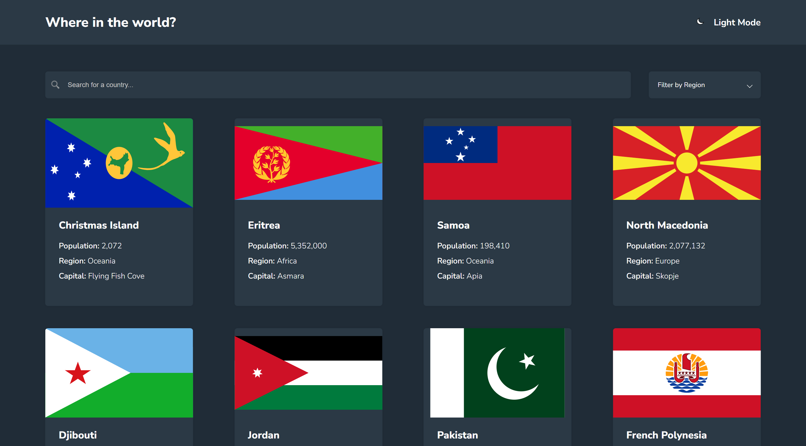

# Frontend Mentor - REST Countries API with color theme switcher solution

This is a solution to the [REST Countries API with color theme switcher challenge on Frontend Mentor](https://www.frontendmentor.io/challenges/rest-countries-api-with-color-theme-switcher-5cacc469fec04111f7b848ca). Frontend Mentor challenges help you improve your coding skills by building realistic projects. 

## Table of contents

- [Overview](#overview)
  - [The challenge](#the-challenge)
  - [Screenshot](#screenshot)
  - [Links](#links)
- [My process](#my-process)
  - [Built with](#built-with)
  - [What I learned](#what-i-learned)
  - [Continued development](#continued-development)
  - [Useful resources](#useful-resources)
- [Author](#author)


## Overview

### The challenge

Users should be able to:

- See all countries from the API on the homepage
- Search for a country using an `input` field
- Filter countries by region
- Click on a country to see more detailed information on a separate page
- Click through to the border countries on the detail page
- Toggle the color scheme between light and dark mode *(optional)*

### Screenshot



### Links

- Solution URL: [Code](https://github.com/m1mmseen/Frontend-Mentor-Rest-API-Countries)
- Live Site URL: [Vercel App](https://m1mmseen-rest-api-countries.vercel.app/)

## My process

### Built with
- Angular
- HTML5
- CSS
- Mobile-first workflow


### What I learned

#### - Using angulars interceptor. In this case for dynamically show loading animation while api requests
```ts
  public intercept(request: HttpRequest<any>, next: HttpHandler): Observable<HttpEvent<any>> {

  this.requests.push(request)
  this.loadingService.isLoading.next(true)

  return new Observable(observer => {
    const subscription = next.handle(request).subscribe( event => {
      if(event instanceof HttpResponse) {
        this.removeRequest(request);
        observer.next(event);
      }
    })
  })
}
```

#### - Working with fallback data in case the api is down

#### - Watching data in routes with subscribers to refresh data in the same component (see useful links)

### Continued development
Every change to the master branch in GitHub are synchronized to the Vercel app deployment.

### Useful resources

- [Angular Theme Switcher](https://codebeyondlimits.com/articles/angular-theming-how-to-create-a-dynamic-theme-switcher-for-light-and-dark-mode)
- [Filter](https://www.w3schools.com/howto/howto_js_filter_lists.asp)
- [Dropdown](https://www.w3schools.com/css/css_dropdowns.asp)
- [Watching Route Param with Subscriber](https://kamranahmed.info/blog/2018/02/28/dealing-with-route-params-in-angular-5)

## Author

- Frontend Mentor - [M1mmseen](https://www.frontendmentor.io/profile/m1mmseen)
